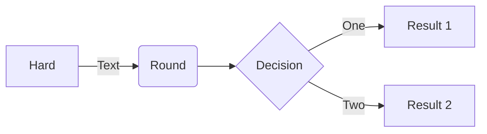
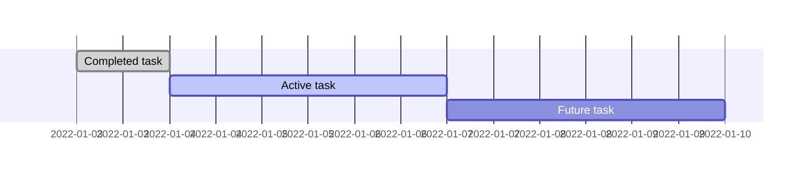
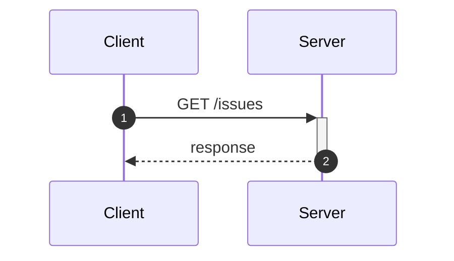

# Mermaid Sample

## sample 1

```mermaid
flowchart LR
    A[Hard] -->|Text| B(Round)
    B --> C{Decision}
    C -->|One| D[Result 1]
    C -->|Two| E[Result 2]
```

## sample 2

```mermaid
graph TD
    A --> B
    A --> C
    B --> D
    C --> D
```

## sample 3

```mermaid
gantt
    Completed task :      done,    t1, 2022-01-03, 1d
    Active task    :      active,  t2, after t1,   3d
    Future task    :               t3, after t2,   3d
```

## sample 4

```mermaid
sequenceDiagram
    autonumber
    Client->>+Server: GET /issues
    Server-->>-Client: response
```